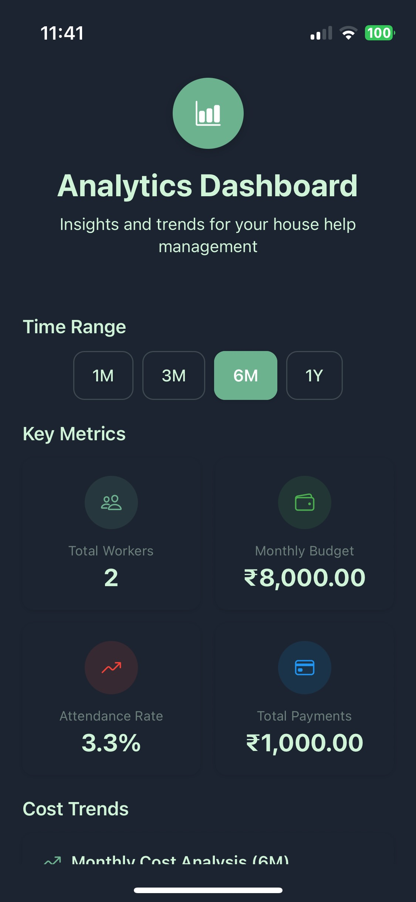
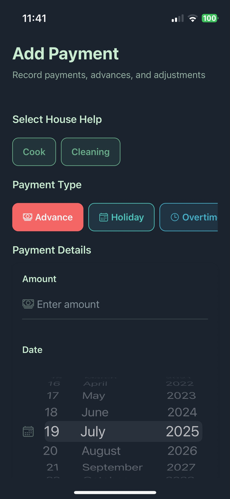
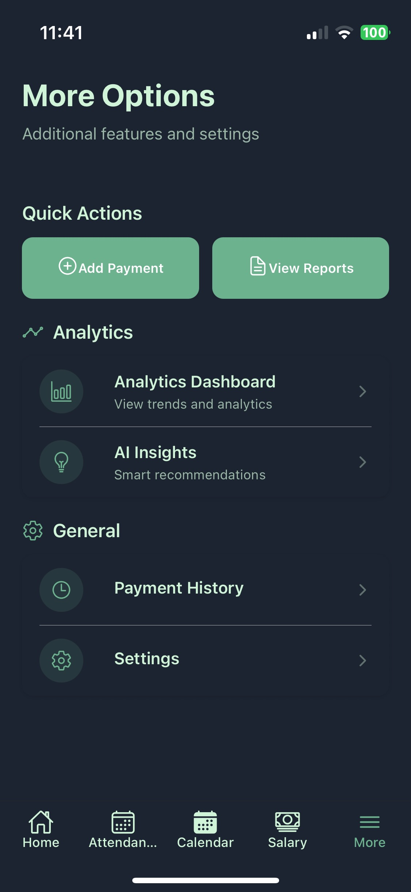

# HouseHelp Manager

> A comprehensive React Native application for managing domestic workers (house helps) with attendance tracking, salary calculation, and payment management.

## 📱 Overview

HouseHelp Manager is a feature-rich mobile application designed to help households efficiently manage their domestic staff. Track attendance, calculate salaries automatically, manage payments, and maintain detailed records with an intuitive and modern interface.

## 🎯 Key Features

### 👥 **House Help Management**

- **Multi-worker Support**: Manage multiple house helps simultaneously
- **Enhanced Add/Edit Forms**: Modern, user-friendly forms with:
  - **Sectioned Layout**: Organized sections for personal info, salary, and schedule
  - **Real-time Validation**: Instant feedback with contextual error messages
  - **Smart Input Fields**: Icon-enhanced inputs with currency symbols and helpers
  - **Daily Wage Calculator**: Automatic daily wage calculation and preview
  - **Animated Interactions**: Smooth animations and loading states
  - **Form Validation**: Required field validation with helpful error guidance
- **Detailed Profiles**: Store comprehensive worker information including:
  - Personal details (name, contact info)
  - Salary structure (monthly salary, daily wage, shift rates)
  - Working schedule (customizable working days)
  - Shift configuration (single or multiple shifts per day)
  - Payment rates (overtime, holiday pay)
- **Smart Defaults**: Automatic population of default working days from settings
- **Edit Mode Enhancements**:
  - Summary view showing current wages and payment history
  - Deletion protection with confirmation dialogs (if enabled in settings)
  - Contextual buttons and improved navigation

### 📅 **Smart Attendance Tracking**

- **Shift-based Tracking**: Mark attendance by completed shifts rather than just present/absent
- **Flexible Status Options**: Present, Absent, Half-day with automatic status calculation
- **Working Days Integration**: Only show workers scheduled for specific days
- **Calendar Integration**: Visual attendance history with color-coded indicators
- **Real-time Updates**: Instant attendance marking with immediate feedback

### 💰 **Automated Salary Calculation**

- **Shift-based Calculation**: Precise salary calculation based on completed shifts
- **Working Days Consideration**: Accounts for individual worker schedules
- **Monthly Summaries**: Comprehensive monthly salary breakdowns
- **Payment Integration**: Includes advances, adjustments, holiday pay, and overtime

### 💳 **Advanced Payment Management**

- **Multiple Payment Types**:
  - Advance payments
  - Holiday pay
  - Overtime compensation
  - Salary adjustments (positive/negative)
- **Database Persistence**: All payments securely stored in SQLite database
- **Payment History**: Detailed transaction records with filtering and loading states
- **Date-based Tracking**: Timeline view of all payments
- **Integration with Salary**: Automatic inclusion in salary calculations
- **Enhanced Error Handling**: Proper error feedback and validation

### 📊 **Advanced Analytics & Reporting**

- **Interactive Dashboard**: Comprehensive analytics with visual charts and graphs
- **Cost Trend Analysis**: Track spending patterns over time with line charts
- **Attendance Analytics**: Visualize attendance trends and patterns with bar charts
- **Payment Breakdown**: Pie charts showing payment distribution by type
- **Top Performer Tracking**: Identify and rank best performing workers
- **Time Range Filtering**: View data for 1M, 3M, 6M, or 1Y periods
- **Performance Metrics**: Detailed efficiency and punctuality scoring
- **Real-time Insights**: Automatic data refresh with pull-to-refresh

### 🧠 **AI-Powered Insights & Recommendations**

- **Smart Cost Optimization**: Automated budget analysis and overrun detection
- **Attendance Pattern Recognition**: Identify low attendance trends and issues
- **Overtime Analysis**: Track excessive overtime usage and suggest optimizations
- **Efficiency Monitoring**: Detect productivity issues and recommend improvements
- **Predictive Analytics**: Forecast potential cost savings and efficiency gains
- **Impact Categorization**: High, medium, and low priority insight classification
- **Actionable Recommendations**: Specific suggestions for management improvements
- **Savings Calculations**: Quantified potential savings from recommendations

### 📅 **Enhanced Calendar View**

- **Visual Calendar**: Interactive calendar with attendance indicators
- **Monthly Navigation**: Easy month-by-month browsing
- **Attendance Summary**: Quick overview of present/absent/half-day counts
- **Color-coded System**: Instant visual feedback on attendance patterns
- **Working Days Filter**: Toggle between all workers vs. scheduled workers

### ⚙️ **Settings & Preferences**

- **Currency Support**: Multi-currency support (₹, $, €, £, ¥) with proper formatting
- **Theme Control**: Manual theme override (Auto/Light/Dark) beyond system preferences
- **Default Configurations**: Customizable default working days for new house helpers
- **Language Options**: English and Hindi language support
- **Backup Settings**: Configurable backup frequency (Daily/Weekly/Monthly/Never)
- **Notification Preferences**: Comprehensive notification and reminder settings
- **User Experience**: Help tips, deletion confirmations, and other UX preferences
- **Database Persistence**: All settings saved locally with loading states

### 🎨 **Modern UI/UX**

- **Theme Support**: Automatic light/dark mode switching based on system preferences
- **Enhanced Form Design**: Modern card-based layouts with sections and visual hierarchy
- **Smart Input Validation**: Real-time validation with contextual error messages and visual feedback
- **Interactive Elements**: Icon-enhanced inputs with currency symbols and helper text
- **Animated Interfaces**: Smooth entrance animations and loading states for better user experience
- **Progressive Forms**: Sectioned forms with clear labeling and guided input flow
- **Visual Feedback**: Daily wage calculations, input previews, and summary information
- **Responsive Design**: Optimized for all screen sizes and orientations
- **Safe Area Support**: Proper handling of notched devices and status bars
- **Intuitive Navigation**: Tab-based navigation with contextual screens
- **Consistent Styling**: Unified design language throughout the app
- **Error Boundaries**: Crash prevention with graceful error handling and recovery
- **Loading States**: Smooth loading indicators for all async operations
- **Smart Buttons**: Context-aware buttons with icons and disabled states during operations

## 🏗️ Architecture

### **Technology Stack**

- **Framework**: React Native with Expo SDK 53
- **Language**: TypeScript for type safety
- **Error Handling**: React Native Toast Message for user feedback
- **Crash Prevention**: Custom ErrorBoundary components for app stability
- **Navigation**: React Navigation 7 with tab-based structure
- **Database**: SQLite with Expo SQLite for local data persistence
- **State Management**: React Context API with custom hooks
- **Styling**: Custom theme system with light/dark mode support
- **Charts & Visualization**: React Native Chart Kit with SVG support
- **Analytics Engine**: Custom analytics utilities with pattern recognition
- **AI Insights**: Intelligent recommendation system with predictive analytics

### **Project Structure**

```
househelp-manager/
├── app/                          # App screens and navigation
│   ├── (tabs)/                  # Tab-based screens
│   │   ├── index.tsx           # Home screen
│   │   ├── attendance.tsx      # Daily attendance marking
│   │   ├── calendar.tsx        # Calendar view
│   │   ├── salary.tsx          # Salary calculations
│   │   └── more.tsx            # Additional features menu
│   ├── _layout.tsx             # Root layout with providers
│   ├── add-house-help.tsx      # Add new worker
│   ├── edit-house-help.tsx     # Edit worker details
│   ├── payments.tsx            # Payment management
│   ├── payment-history.tsx     # Payment history
│   ├── reports.tsx             # Analytics dashboard
│   └── insights.tsx            # AI insights and recommendations
├── components/                   # Reusable UI components
│   ├── AttendanceMarker.tsx    # Shift-based attendance marking
│   ├── HouseHelpItem.tsx       # Worker list item
│   ├── ThemedText.tsx          # Theme-aware text component
│   ├── ThemedView.tsx          # Theme-aware view component
│   └── WorkingDaysSelector.tsx # Working days configuration
├── contexts/                     # Global state management
│   ├── HouseHelpContext.tsx    # Worker data management
│   ├── AttendanceContext.tsx   # Attendance tracking
│   ├── PaymentContext.tsx      # Payment management
│   └── SettingsContext.tsx     # App settings
├── hooks/                        # Custom React hooks
│   ├── useTheme.ts             # Theme management
│   └── useThemeColor.ts        # Color utilities
├── screens/                      # Screen components
│   ├── ReportsScreen.tsx       # Analytics dashboard screen
│   ├── InsightsScreen.tsx      # AI insights screen
│   └── [other screens...]      # Additional screen components
├── utils/                        # Utility functions
│   ├── database.ts             # SQLite database operations
│   └── analytics.ts            # Analytics calculations and insights
└── styles/                       # Theme definitions
    └── themes.ts               # Light/dark theme colors
```

### **Data Architecture**

- **Local-first**: All data stored locally using SQLite
- **Offline Capable**: Works completely offline with no internet dependency
- **Relational Structure**: Proper foreign key relationships between entities
- **Type Safety**: Comprehensive TypeScript interfaces for all data models

## 🚀 Installation & Setup

### **Prerequisites**

- Node.js (v18 or later)
- npm or yarn package manager
- Expo CLI
- iOS Simulator (for iOS development) or Android Studio (for Android development)

### **Installation Steps**

1. **Clone the repository**:

   ```bash
   git clone https://github.com/Piyushhbhutoria/househelp-manager.git
   cd househelp-manager
   ```

2. **Install dependencies**:

   ```bash
   npm install
   # or
   yarn install
   ```

3. **Start the development server**:

   ```bash
   npx expo start
   ```

4. **Run on device/simulator**:

   ```bash
   # iOS Simulator
   npx expo run:ios
   
   # Android Emulator
   npx expo run:android
   
   # Physical device via Expo Go app
   # Scan QR code from expo start command
   ```

## 📖 Usage Guide

### **Adding House Helps**

1. Navigate to Home tab
2. Tap "Add House Help" button
3. Fill in worker details:
   - Name and basic information
   - Monthly salary and shift count
   - Select working days of the week
4. Save to create the profile

### **Marking Attendance**

1. Go to Attendance tab
2. Select number of shifts completed for each worker
3. Status automatically calculated:
   - 0 shifts = Absent
   - Partial shifts = Half-day  
   - Full shifts = Present

### **Viewing Salary Information**

1. Navigate to Salary tab
2. Use month navigation to view different periods
3. See breakdown of:
   - Base salary (based on attendance)
   - Holiday pay and overtime
   - Advance payments
   - Final calculated salary

### **Managing Payments**

1. Access through More tab > Payments
2. Add different payment types:
   - Advance payments
   - Holiday pay
   - Overtime compensation
   - Salary adjustments
3. View complete payment history

### **Analytics Dashboard**

1. Navigate to More tab > Analytics Dashboard
2. Select time range (1M, 3M, 6M, 1Y) for analysis
3. View comprehensive analytics:
   - Key performance statistics cards
   - Cost trends over time (line chart)
   - Attendance patterns (bar chart)
   - Payment breakdown by type (pie chart)
   - Top performing workers ranking
4. Pull down to refresh data in real-time
5. Use visual insights to optimize management

### **AI Insights & Recommendations**

1. Access through More tab > AI Insights
2. Review automatically generated insights:
   - **High Priority**: Critical issues requiring immediate attention
   - **Medium Priority**: Important optimizations and improvements
   - **Low Priority**: Minor suggestions for better efficiency
3. Each insight includes:
   - Clear problem description
   - Impact assessment
   - Specific actionable recommendations
   - Potential cost savings (where applicable)
4. Use Quick Actions for immediate navigation to related features
5. Share insights summary via built-in sharing functionality

## 🔧 Development

### **Building for Production**

```bash
# iOS Build
npx expo build:ios

# Android Build  
npx expo build:android

# EAS Build (Recommended)
npx eas build --platform ios
npx eas build --platform android
```

### **Testing**

```bash
# Run tests
npm test

# Run with coverage
npm run test:coverage
```

### **Linting**

```bash
# Run ESLint
npm run lint

# Fix linting issues
npm run lint:fix
```

## 🎨 Theme System

The app includes a comprehensive theme system supporting both light and dark modes:

- **Automatic Detection**: Follows system theme preference
- **Consistent Colors**: Unified color palette across all components
- **Theme-aware Components**: `ThemedText` and `ThemedView` automatically adapt
- **Accessibility**: Proper contrast ratios in both themes

## 🗄️ Database Schema

### **House Helps Table**

- `id`: Unique identifier
- `name`: Worker name
- `monthlySalary`: Monthly salary amount
- `shifts`: Maximum shifts per day
- `dailyWage`: Calculated daily wage
- `workingDays`: JSON array of working days (0-6)
- `overtimeRate`, `holidayRate`: Additional payment rates
- `advancePayment`, `adjustments`: Payment modifications

### **Attendance Table**

- `id`: Unique identifier
- `houseHelpId`: Foreign key to house help
- `date`: Attendance date (YYYY-MM-DD)
- `status`: present | absent | half-day
- `shiftsCompleted`: Number of shifts completed

## 🤝 Contributing

We welcome contributions! Please follow these steps:

1. Fork the repository
2. Create a feature branch (`git checkout -b feature/amazing-feature`)
3. Commit your changes (`git commit -m 'Add amazing feature'`)
4. Push to the branch (`git push origin feature/amazing-feature`)
5. Open a Pull Request

### **Development Guidelines**

- Follow TypeScript best practices
- Use the existing theme system for styling
- Write tests for new features
- Follow the established file structure
- Use meaningful commit messages

## 📋 Recent Updates

### **Phase 1: Critical Fixes & Core Improvements** *(December 2024)*

#### ✅ **Payment Data Persistence**

- **Fixed Critical Issue**: Payments now properly saved to SQLite database
- **Database Schema**: Added payments table with proper foreign key relationships
- **Context Updates**: Enhanced PaymentContext with database operations and loading states
- **Data Migration**: Seamless migration for existing installations

#### ⚙️ **Enhanced Settings & Preferences**

- **Multi-Currency Support**: Added ₹, $, €, £, ¥ with intelligent formatting
- **Theme Override**: Manual theme selection (Auto/Light/Dark) beyond system preferences
- **Default Configurations**: Customizable working days for new house helpers
- **Language Support**: English and Hindi language options
- **Backup Preferences**: Configurable backup frequency settings
- **Settings Persistence**: All preferences saved to database with loading states

#### 🚨 **Enhanced Error Handling**

- **Toast Notifications**: User-friendly success/error messages using react-native-toast-message
- **Error Boundaries**: Crash prevention with graceful error recovery
- **Loading States**: Added loading indicators to all contexts and async operations
- **Input Validation**: Enhanced form validation with proper error feedback
- **App Stability**: Improved overall reliability and user experience

#### 🔧 **Technical Improvements**

- **Database Operations**: Added payment CRUD operations to utils/database.ts
- **Currency Utilities**: Created comprehensive currency formatting system
- **Context Consistency**: Standardized loading states across all contexts
- **Type Safety**: Enhanced TypeScript interfaces for all new features
- **Error Recovery**: Implemented graceful error handling throughout the application

## 📄 License

This project is licensed under the Apache License 2.0. See the [LICENSE](LICENSE) file for details.

## 🆘 Support

For support and questions:

- Open an issue on GitHub
- Review the documentation
- Check existing issues for solutions

## 📱 Screenshots

<div style="display: flex; flex-wrap: wrap; gap: 10px;">
  
  
  
  
  
  
  <!--  -->
  
  <!--  -->
  <!--  -->
  
</div>

---

**Built with ❤️ for efficient household management**
