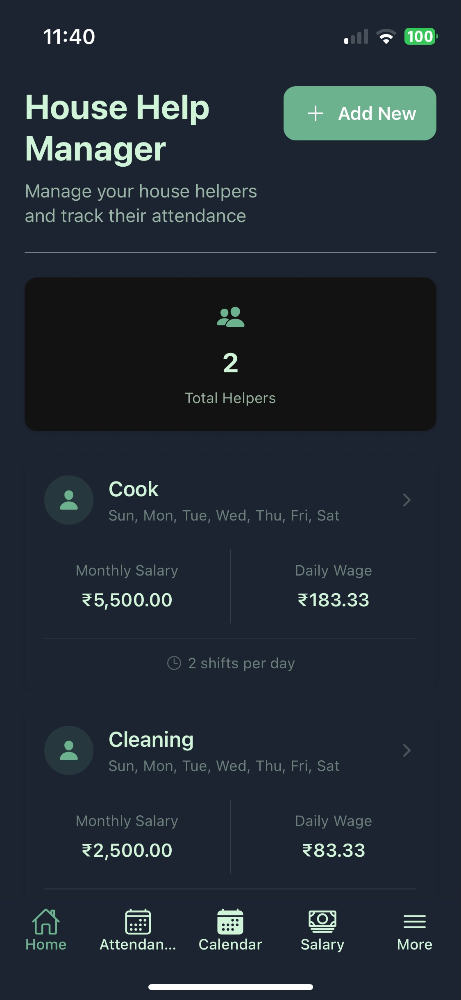
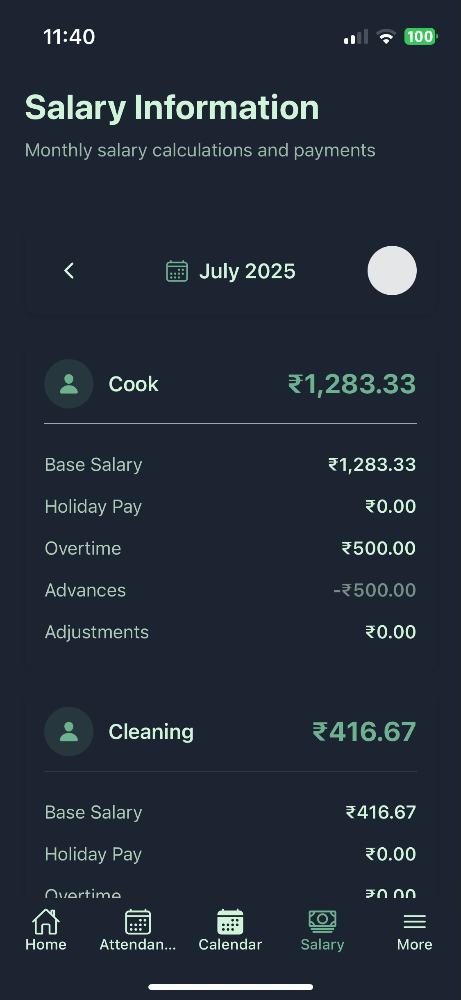
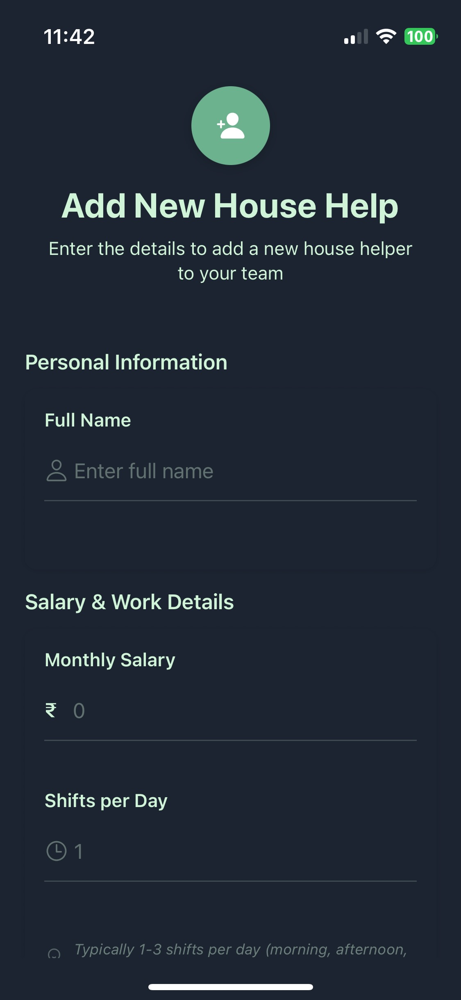

# HouseHelp Manager

HouseHelp Manager is a React Native application designed to help users manage and track the attendance and salary of house helps. The app provides features to add, edit, and view house help details, mark attendance, and calculate salaries based on attendance records.

## Screenshots

<div style="display: flex; flex-wrap: wrap; gap: 10px;">
  
  
  
  
  <!--  -->
  
  <!--  -->
</div>

## Features

### Core Features

- **Multiple House Help Management**: Track up to 5 house helps simultaneously
- **Attendance Tracking**:
  - Mark daily attendance (Present/Absent/Half-day)
  - Configure multiple shifts per house help
  - Calendar view for attendance history
- **Salary Management**:
  - Automatic salary calculation based on attendance
  - Support for advance payments and adjustments
  - Holiday pay and overtime calculations
  - Monthly salary summaries

### Payment Features

- **Advanced Payment Handling**:
  - Record advance payments
  - Track holiday pay
  - Manage overtime payments
  - Handle salary adjustments
- **Payment History**:
  - Detailed transaction history
  - Filter by payment type
  - Monthly payment summaries

### UI/UX Features

- **Modern Interface**:
  - Clean, intuitive navigation
  - Safe area support for notched devices
  - Responsive design for all screen sizes
- **Theme Support**:
  - Automatic light/dark theme switching
  - System theme integration
  - Consistent styling throughout the app

## Tech Stack

- **React Native**: For building the mobile application
- **Expo**: For development and testing
- **SQLite**: For local data storage
- **TypeScript**: For type-safe code
- **React Navigation**: For app navigation
- **Expo SQLite**: For local database management

## Installation

1. **Clone the repository**:

   ```bash
   git clone https://github.com/Piyushhbhutoria/househelp-manager.git
   cd househelp-manager
   ```

2. **Install dependencies**:

   ```bash
   npm install
   ```

3. **Install Expo CLI** (if not already installed):

   ```bash
   npm install -g expo-cli
   ```

4. **Start the Expo server**:

   ```bash
   npx expo start
   ```

## Development

### Project Structure

```
househelp-manager/
├── app/                    # App screens and navigation
│   ├── (tabs)/            # Tab-based screens
│   └── _layout.tsx        # Root layout configuration
├── components/            # Reusable components
│   ├── navigation/        # Navigation components
│   └── themed/           # Themed components
├── contexts/             # React contexts
├── hooks/                # Custom hooks
└── utils/               # Utility functions
```

### Key Components

- **Navigation**: Tab-based navigation with More menu for additional features
- **Database**: Local SQLite database for data persistence
- **Contexts**: Global state management for house helps, attendance, and payments
- **Theming**: Dynamic theme support with light and dark modes

## Building and Deployment

### iOS Build

```bash
npx expo run:ios
```

### Android Build

```bash
npx expo run:android
```

## Contributing

Contributions are welcome! Please fork the repository and submit a pull request for any improvements or bug fixes.

## License

This project is licensed under the Apache License. See the [LICENSE](LICENSE) file for details.
